# Volkswagen Classic App

Una aplicació completa per als veritables aficionats dels cotxes clàssics de Volkswagen, desenvolupada amb Flutter.

## Característiques principals

*   **Catàleg Extens de Models:** Explora una base de dades detallada de models clàssics de Volkswagen. Cada model inclou informació sobre els anys de producció, unitats fabricades, detalls tècnics i context històric.
*   **Galeria d'Imatges:** Gaudeix d'una àmplia col·lecció d'imatges d'alta qualitat per a cada model, mostrant diferents versions, colors i detalls.
*   **Descodificador de VIN Avançat:** Introdueix un número d'identificació del vehicle (VIN) de 17 dígits per obtenir informació precisa sobre el teu cotxe, com el país de fabricació, la planta de muntatge, l'any del model i altres especificacions.
*   **Cerca per Número de Xassís:** Utilitza el número de xassís per identificar el model corresponent i obtenir una data de producció aproximada, ideal per a models anteriors al VIN estandarditzat.
*   **Mapa Interactiu de Plantes:** Visualitza en un mapa les plantes de fabricació de Volkswagen d'arreu del món, descobrint on es van construir els models icònics.
*   **Suport Multilingüe:** L'aplicació està disponible en diversos idiomes per a una experiència més accessible:
    *   Català
    *   Espanyol
    *   Anglès
    *   Alemany
    *   Francès
    *   Portuguès
*   **Integració amb IA:** La tecnologia d'IA generativa de Google Gemini s'utilitza per enriquir el contingut i oferir descripcions dinàmiques i detallades.

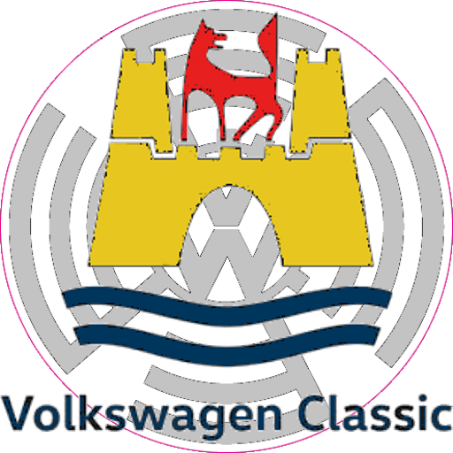

## Com contribuir

Si vols contribuir al projecte, ets benvingut a obrir una "issue" per reportar errors o suggerir millores, o enviar una "pull request" directament al nostre repositori de GitHub.

## Crèdits

*   **[Amics del Volkswagen de Catalunya](https://www.avwc.org/edatvw.php):** Grup d'amics que tenen una passió comuna: els seus VW Escarabats, fundat l'any 1983.
*   **[Amics dels Escarabats de ses Illes Balears](http://aeib.info):** Comunitat d'entusiastes de models Air-Cooled com el Beetle, Karmann Ghia, T1, T2, etc.
*   **[TheSamba.com](https://www.thesamba.com/vw/archives/info/bugchassisdating.php):** Un recurs de referència per a anuncis classificats, fotos, esdeveniments, fòrums i informació tècnica sobre l'automòbil Volkswagen.
*   **[Google Firebase & Gemini](https://firebase.google.com):** La infraestructura de backend i la tecnologia d'IA generativa que impulsen l'aplicació.

## Imatges
<table>
<tbody>
<tr>
<td></td>
<td>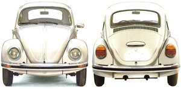</td>
<td>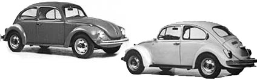</td>
</tr>
<tr>
<td>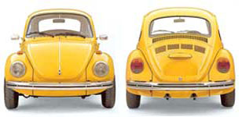</td>
<td>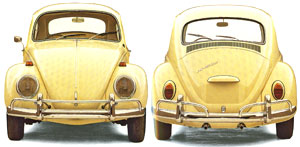</td>
<td>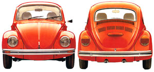</td>
</tr>
<tr>
<td>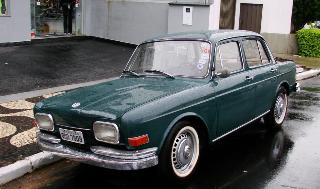</td>
<td>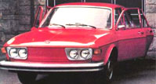</td>
<td>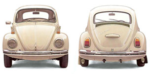</td>
</tr>
<tr>
<td>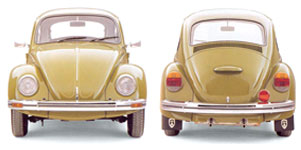</td>
<td>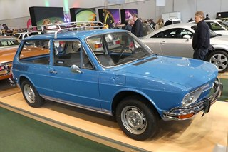</td>
<td>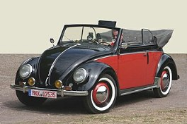</td>
</tr>
<tr>
<td>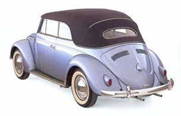</td>
<td>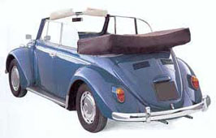</td>
<td>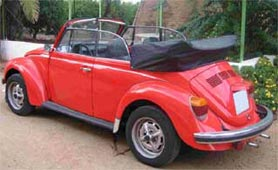</td>
</tr>
<tr>
<td>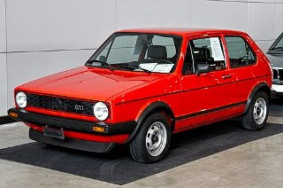</td>
<td>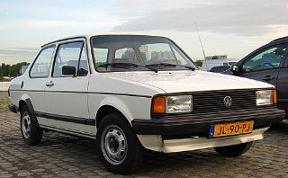</td>
<td>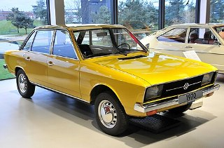</td>
</tr>
<tr>
<td>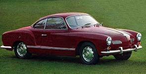</td>
<td>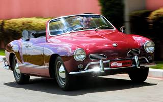</td>
<td>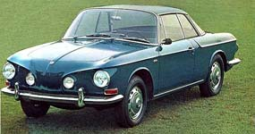</td>
</tr>
<tr>
<td>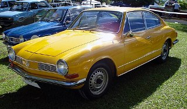</td>
<td>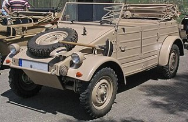</td>
<td>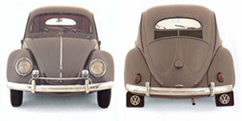</td>
</tr>
<tr>
<td>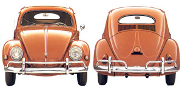</td>
<td>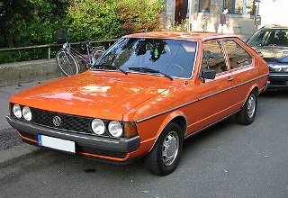</td>
<td>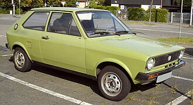</td>
</tr>
<tr>
<td>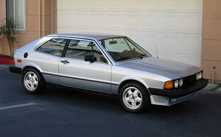</td>
<td>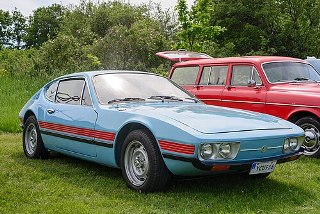</td>
<td>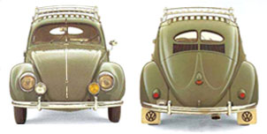</td>
</tr>
<tr>
<td>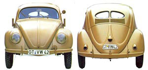</td>
<td>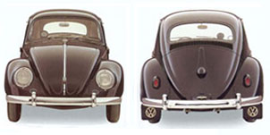</td>
<td>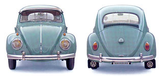</td>
</tr>
<tr>
<td>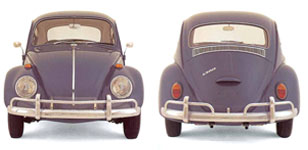</td>
<td>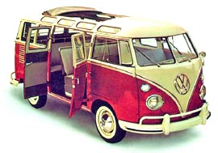</td>
<td>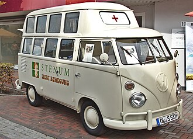</td>
</tr>
<tr>
<td>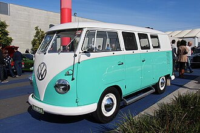</td>
<td>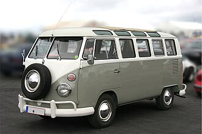</td>
<td>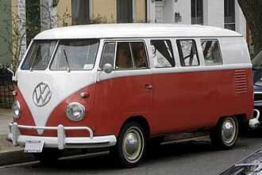</td>
</tr>
<tr>
<td>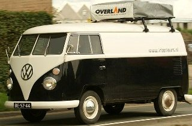</td>
<td>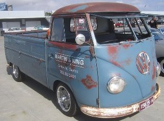</td>
<td>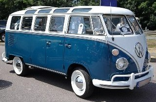</td>
</tr>
<tr>
<td>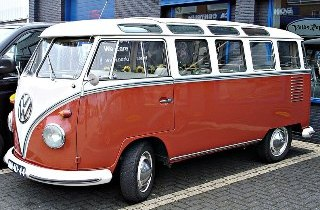</td>
<td>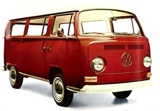</td>
<td>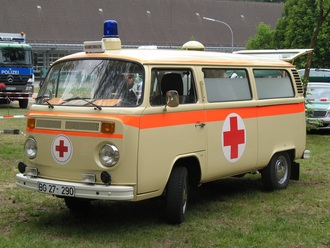</td>
</tr>
<tr>
<td>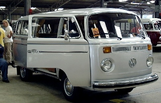</td>
<td>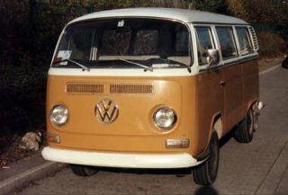</td>
<td>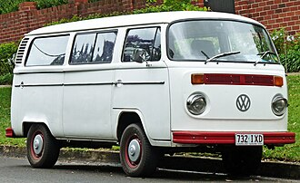</td>
</tr>
<tr>
<td>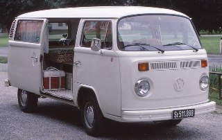</td>
<td>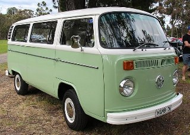</td>
<td></td>
</tr>
<tr>
<td></td>
<td></td>
<td></td>
</tr>
<tr>
<td></td>
<td></td>
<td></td>
</tr>
<tr>
<td></td>
<td></td>
<td></td>
</tr>
<tr>
<td></td>
<td></td>
<td></td>
</tr>
</tbody>
</table>